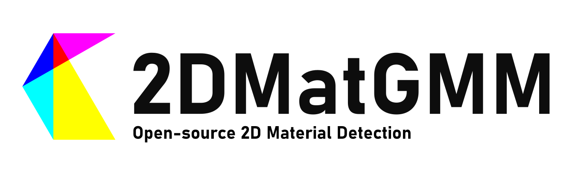

# 2DMatGMM Website



[](https://arxiv.org/abs/2306.14845) [](https://flakedemo.uslu.tech) [](LICENSE) [](https://doi.org/10.5281/zenodo.8042835) [](#Citing2DMatGMM)

Welcome to the repository for the 2DMatGMM website. The project provides a comprehensive platform to analyze, filter, and find suitable flakes for stacking. Our backend is powered by Flask-Python while the frontend utilizes React-Javascript for an optimized user interface.

## Features

- **Filtering:** Filter the flakes based on their properties such as size, shape, and quality.
- **Analysis:** Analyze the flakes in detail by viewing them in multiple different magnifications.
- **Download:** Download the raw flake images from the microscope as well as their metadata for further analysis.

## Repository Structure

The paper comprises three repositories each containing a part of the project:

- [2DMatGMM](https://github.com/Jaluus/2DMatGMM): The code for the machine learning model and the detection algorithm.
- [2DMatGMM-System](https://github.com/Jaluus/2DMatGMM-System): The full detection system used in the laboratory.
- [**2DMatGMM-Website**](https://github.com/Jaluus/2DMatGMM-Website): The code for the website to analyse, filter and download the flakes.

## Installation and Deployment

For detailed instructions on how to install and deploy the 2DMatGMM Website, please refer to the [Installation Guide](INSTALL.md).

## Live Demo

Visit our [Demo Website](https://flakedemo.uslu.tech) to explore the features and functionalities of the 2DMatGMM Website.

## <a name="Citing2DMatGMM"></a>Citing 2DMatGMM

If you use our work in your research or find the code helpful, we would appreciate a citation to the original paper:

```bibtex

@misc{uslu2023opensource,
      title={An open-source robust machine learning platform for real-time detection and classification of 2D material flakes}, 
      author={Jan-Lucas Uslu and Taoufiq Ouaj and David Tebbe and Alexey Nekrasov and Jo Henri Bertram and Marc Schütte and Kenji Watanabe and Takashi Taniguchi and Bernd Beschoten and Lutz Waldecker and Christoph Stampfer},
      year={2023},
      eprint={2306.14845},
      archivePrefix={arXiv},
      primaryClass={cond-mat.mes-hall}
}

```

## Contact

If you encounter any issues or have questions about the project, feel free to open an issue on our GitHub repository.
This Repo is currently maintained by [Jan-Lucas Uslu](mailto:jan-lucas.uslu@rwth-aachen.de).
